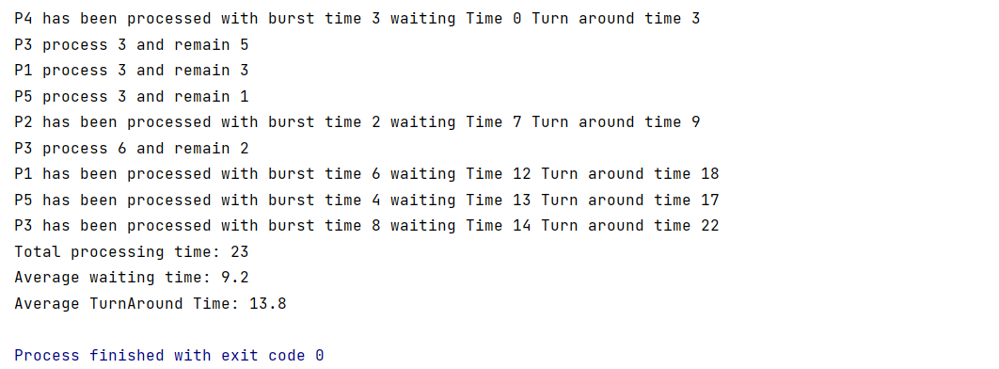

# CPU scheduling algorithms RR and SJF
This project is an implementation for Round-Robin scheduling (RR) and Shortest-Job-First (SJF) and output for the next example:

## Round-Robin Scheduling
RR is a preemptive algorithm which based on FCFS approach with quantum time; each process or job present in the ready queue is assigned the CPU for that time quantum, if the execution of the process is completed during that time then the process will end else the process will go back to the waiting table and wait for its next turn to complete the execution.
In this implementation <a href="https://github.com/rawdaibrahim/scheduling_algorithms/blob/main/RR/RoundRobin.java">RR.java</a> i used a queue data structure to hold arrived processes; each process represented by a process object which holds all its information 
output: 

## Shortest-Job-First
SJF is a non-preemptive 
